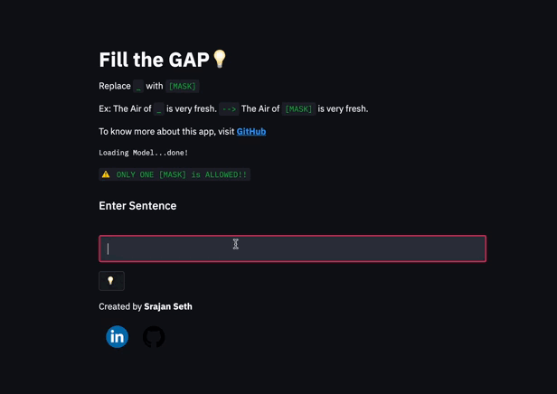

# Fill the GAP

**Fill the GAP** is an `End-to-End NLP model` which takes a Sentance and replace `[MASK]` based on context deployed on **Streamlit**

**Model :** **`Bert Base Uncased`**

**Library :** **`🤗 Hugging Face `**

**Pre-Trained on :** **`English language using a masked language modeling (MLM)`**

## [View Deployed Demo on Streamlit](https://share.streamlit.io/srajanseth84/all-ml-projects-streamlit/main/app.py)

## Demo



## Run Locally

* Clone the project

```bash
  git clone https://github.com/srajanseth84/FTG.git
```

* Go to the project directory

```bash
  cd FTG
```
* Create venv

```bash
  python3 -m virtualenv venv 
```

* Activate the venv

```bash
  source venv/bin/activate
```

* Install dependencies

```bash
  pip install -r requirements.txt
```

* Start the server

```bash
  streamlit run app.py 
```

## BERT MODEL DESCRIPTION

BERT is a transformers model pretrained on a large corpus of English data in a self-supervised fashion. This means it was pretrained on the raw texts only, with no humans labelling them in any way (which is why it can use lots of publicly available data) with an automatic process to generate inputs and labels from those texts. More precisely, it was pretrained with two objectives:

- **Masked language modeling (MLM)**: taking a sentence, the model randomly masks 15% of the words in the input then run the entire masked sentence through the model and has to predict the masked words. This is different from traditional recurrent neural networks (RNNs) that usually see the words one after the other, or from autoregressive models like GPT which internally mask the future tokens. It allows the model to learn a bidirectional representation of the sentence.
- **Next sentence prediction (NSP)**: the models concatenates two masked sentences as inputs during pretraining. Sometimes they correspond to sentences that were next to each other in the original text, sometimes not. The model then has to predict if the two sentences were following each other or not.


This way, the model learns an inner representation of the English language that can then be used to extract features useful for downstream tasks: if you have a dataset of labeled sentences for instance, you can train a standard classifier using the features produced by the BERT model as inputs.

## Dependencies

* [Tensorflow](https://github.com/tensorflow/tensorflow)
* [Tensorflow-Hub](https://github.com/tensorflow/hub)
* [Streamlit](https://github.com/streamlit/streamlit)
* [Numpy](https://github.com/numpy/numpy)
* [Pillow](https://github.com/python-pillow/Pillow)
* [Pre-trained Model Used](https://tfhub.dev/google/magenta/arbitrary-image-stylization-v1-256/2)  

## Tech Stack
* **Front-End**: [Streamlit](https://github.com/streamlit/streamlit)
* **Cloud**: [Streamlit Cloud](https://streamlit.io/cloud)
* **DL-Framework**: [Hugging Face](https://huggingface.co/)

## Reference

- [Hugging Face 🤗](https://huggingface.co/)
## Author

- [@srajanseth84](https://github.com/srajanseth84)

  
